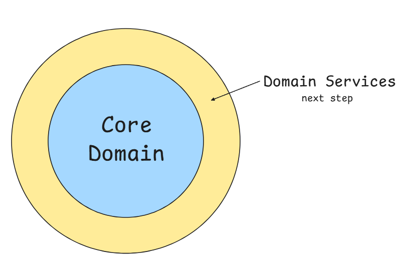

# Guild Project DDD

## Why am I doing this?

It’s been a while since I transitioned from being a developer to managing development teams. Over these three years, I’ve focused on strengthening my skills in people management, leadership, and understanding how to best perform in this role.

Growing into this new world has been enjoyable, but in some ways, I miss getting my hands dirty—writing code and learning new things.

The idea behind this project is to use some of my free time to study and explore technical topics without deadlines, using it as a playground for exploring things I’ve always wanted to learn or topics I’ve only had superficial knowledge of.

## What I want to explore

Well, from start I want to re(read) some technical books and try put every concept in a orthodox way to reflect on trade offs.

I also want to learn a new programming language. I chose go because I though it will be fun :D

For this project, I've prepare a list of books. Some I've already read, other were recommended by friends but I never read and now its time to read them all.

Books:

- ~~Go The Programming Language~~
- Implementing DDD by Vernon <- _reading_
- The Pragmatic Programmer - 20th Anniversary Edition
- Refactoring 1st & 2nd edition
- Agile Software Development
- Designing Object Oriented C++ Applications Using The Booch Method
- Enterprise Integration Patterns
- Patterns of Enterprise Application Architecture
- Clean Architecture
- Software Architecture - Hard Parts
- Build Evolutionary Architectures
- DDD by Evans
- Functional and Reactive Domain Modeling
- Design Data Intensive Applications
- Web Application Security: Exploitation and Countermeasures for Modern Web Applications
- Grokking Web Application Security

Yeah ... I's a lot of book, but time isnt a problem here.

**It is a small project, is it worth that effort and maybe future overengineer?** Surely not, but the object here is just get hands dirty and evaluate trade off.

## About the Guild Project

The main idea here is try to reproduce a guild system, very common in many games. The main "requirements" are:

- Create a guild. (obviously)
- A Guild must have a Guild Master (GM), a Vault to store items and Gold, and a especial stash call Treasure. The Treasure is responsible to store an special currency which will be donated by guild members. Every donation must be approved by a GM (only)
- To join the guild, a player can be invited by other player, or be added directly by the Guild Master.
- To make it clear, invite sent by a GM, the invitee will be automatic add to the Guild.
- The Guild has maximum capacity up to 50 players and 50 pending invites
- Along side the GM, some aspects of the Guild can by managed by another role called Guild Commander (GC).
- GC are regular members promoted by a GM.
- Only a GM can promote players to GC or demote them.
- Both GM and GC can remove players from Guild
- Both GM and GC can add new players to Guild.
- To make it clear, invites sent by GC, the invitee also will be automatic add to the Guild.
- GC cannot remove other GC nor demote them
- GC cannot promote players to GC
- Player cannot remote nor add players
- Player are able to leave your current guild
- Regular guild members can invite others players
- Invites can be approved or reject by GM or GC
- Invites can be cancelled by who send
- Every member can store items and gold on Guild's Vault.
- For now, vault doesnt have a maximum capacity

To address all this requirements, I've drew this analysis class diagram:


It's just the first approach to try to understand the main components and it's relations. It's not a Design Diagram.

## What do we have so far?

As I progressed reading Go The Programming language and consuming other content about Go, I made this firts domain implementation.

```
domain/
├── common/
    └── base_error.go
    └── base_id.go
    └── status.go
├── guild/
    └── valueobjects/
        └── guild_id.go
        └── invite_id.go
    └── error.go
    └── guild_test.go
    └── guild.go //aggrated root
    └── invite.go
├── item/
    └── valueobjects/
        └── item_id.go
    └── error.go
    └── item_test.go
    └── item.go
├── player/
    └── valueobjects/
        └── class.go
        └── player_id.go
    └── error.go
    └── player_test.go
    └── player.go
├── treasure/
    └── valueobjects/
        └── donation_id.go
        └── treasure_id.go
    └── donation.go
    └── treasure.go
```

During this process I realized that I need to add new entities (classes) into my first diagram to make things works. I also adding new rules and validations.

Donation features will be implement after a complete foundation.

## Next Step

Starting implementing the Domain Service layer:



Here I want to read Implementing DDD by Vernon and explore concepts like Domain Services, Repositories, Domain Events and how can I take advantage of them to implement Donation's Features and create a kind of trace log transctions of items and gold in vault
