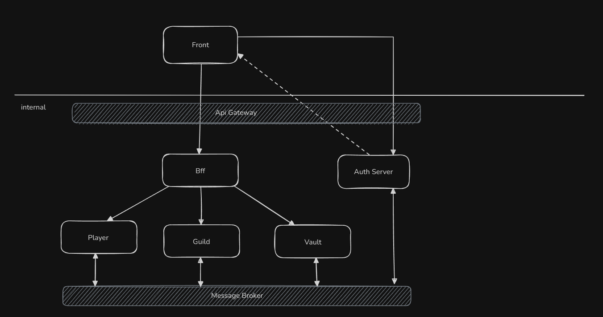

# Guild Project DDD

## Project Overview

The objetive of this project is design a kind of guild system, popular in rpg games, using Go and trying to put DDD practices as long the project evolves.
Trying to push my understand of DDD, I'm focus to get maximum modularity, where each module will acting as a separated microservices.
I believe this approach will help me face some problems, like authentication, consistency and other design problems to think and find way to address it.

## High Level Architecture _(deprecated -- updates soon)_

### Key Modules

- ~~Auth Server - Responsible to handle authentication and user session. In the future I want to connect it to a Api Gateway to centralize the authentication/authorization concerns. I also want to change this to a prebuilt tool like Keycloack and see how these will impact my system design.~~ **Replaced for Keycloak**

- Character - Responsible for create characters for a player. A player is consider someone with a valid login.

- Guild - Responsible to handle all guild concerns. Here we want to be able to create guild, invite others Character to our guild, promote, demote or kick Members. Players will be able to donate gold and cash to a Guild and we want to track those actions to create a report of transactions.

- Vault - Responsible to handle all vault concerns. Although a Vault have its own life cycle, to be consistent it should communicate with Player and Guild module.

## Progress

### Auth Server

**Status:** _deprecated -- using now keycloak :)_

### Character

**Status:** _in progress_

**Features Available:**

- [x] Create New Character
- [] Pick Items and Gold
- [] Drop Items and Gold
- [] Show inventory items
- [] Transfer items to Vault
- [] Retrieve items from vault
- [] Deposit gold to vault
- [] Withdraw gold from vault
- [] Leave a guild

**To Do List:**

- [ ] Create basic structure _(Migrating to Hexagonal architecture structure)_
- [ ] Create app layer
- [ ] Create infra layer
- [ ] Create domain events
- [ ] Explore hexagonal architecture fundamentals

### Guild

**Status:** _backlog_

**Features Available:**

- Create a guild
- Delete a guild
- Invite players
- Add players
- Remove players
- Leave guild
- Promote players
- Demote player

**To Do List:**

- [ ] Create basic structure

### Vault

**Status:** _backlog_

**Features Available:**

- Create a vault
- Deleta a vault
- Add/Retrieve items to a vault

_Personal thoughts: Both player and guild will have a vault, so here we will have a Authorization problem between diferent domains to handle_

**To Do List:**

- [ ] Create basic structure

### Key Features to explore in future

- **API Gateway** - Central entry point for request routing, composition, and security
- **Service Discovery** - Dynamic registration and lookup of distributed services
- **Rate Limiting** - Traffic control to prevent overload and ensure fair usage
- **Service Mesh** - Managed service-to-service communication with observability and security
- **Circuit Breaker** - Failure containment pattern to prevent cascading system failures
